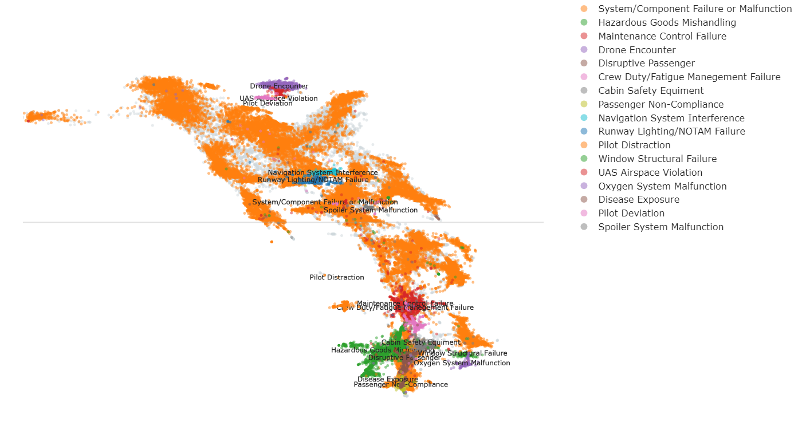

# Exploring Aviation Safety Risk Factors through BERTopic Modeling of Incident Reports

You can try to put some sample of incident report similar to ASRS here:
**[Aviation Risk Identification](https://aviation-risk-identification-bertopic.streamlit.app/)**

---

## Abstract
The increasing volume of aviation incident narratives presents both an opportunity and a challenge for safety analysis. This study introduces a dynamic topic modeling framework based on BERTopic to automatically identify and trace aviation safety risk factors from 57,292 reports in NASA’s Aviation Safety Reporting System (2013–2023).

The framework integrates transformer-based embeddings, dimensionality reduction (UMAP), and density-based clustering (HDBSCAN) to discover coherent topics without predefined parameters. Topic representations were refined through KeyBERTInspired and Maximal Marginal Relevance (MMR), while labeling was supported by large language models and validated against ICAO taxonomies.

The best-performing model (M5) achieved the highest coherence (c_v = 0.646) and diversity (0.829), generating seventeen distinct and interpretable risk factors encompassing technical, operational, and behavioral dimensions of aviation safety.

---

## Methodology
The topic modeling process followed the BERTopic pipeline with fine-tuning steps for representation refinement.

---

## Results
The model generated 17 distinct risk factors.

### Identified Risk Factors
| Topic | Count | Representation | Label (T5) | Label (Alpaca) | Final Validated Label |
| :--- | :--- | :--- | :--- | :--- | :--- |
| -1 | 16370 | atc, pilot, landing, 000, final, turn, asked, clearance, visual, takeoff | - | - | - |
| 0 | 33490 | aircraft, landing, time, engine, atc, turn, control, ground, gear, maintenance | Pilot deviation | Engine Failure. | System/Component Failure or Malfunction |
| 1 | 1687 | dg, cargo, dangerous goods, hazmat, ramp, dry, paperwork, received, aircraft, dispatch | Hazardous Goods | Hazardous Goods: Explosive Release Devices, Dry Ice, Planned Dangerous Goods, Inconsistencies with Planned Dangerous Goods, Unusual Contents, Unauthorized Access | Hazardous Goods Mishandling |
| 2 | 1625 | maintenance, mel, aircraft, mechanic, work, logbook, installed, crew, manual, task | Maintenance | Maintenance Control - Oversight - Unlawful Sign-off - Unreliable Measurement - Unreliable Procedures - Unreliable Procedures - Unreliable Procedures - Unreliable Procedures | Maintenance Control Failure |
| 3 | 688 | drone, saw, appeared, altitude, uas, near, atc, msl, color, 500 | drone | <No Result> | Drone Encounter |
| 4 | 590 | flight attendant, fa, passengers, seat, boarding, door, galley, minutes, safety, medlink | medlink | Emergency Safety Risk Factor: Seizure | Disruptive Passenger |
| 5 | 461 | flight, hours, duty, company, fatigued, 117, training, scheduled, crew scheduling, captain | fatigued | Flight Delay | Crew Duty/Fatigue Management Failure |
| 6 | 382 | slide, maintenance, cargo, latch, flight attendant, disarmed, noise, cockpit, cabin door, safety | cockpit door | Safety Issue. | Cabin Safety Equipment |
| 7 | 344 | wearing, fa, mask policy, seat, face mask, covering, comply, child, flight attendant, nose mouth | wearing | Regulatory Non-Compliance | Passenger Non-Compliance |
| 8 | 270 | gps, jamming, nav, rnp, interference, transponder, eicas, messages, dme, airspace | GPS Loss of Signal/GPS Signal Interference | Safety Risk Factor: GPS Jamming/Interference. | Navigation System Interference |
| 9 | 251 | bright, runway lights, notam, pilot, beacon, taxiway, red, night vision, distracting, time | bright | Runway incursion. | Runway Lighting/NOTAM Failure |
| 10 | 210 | ipad, efb, charts, mount, update, use, jeppesen, pilot, fd pro, manuals | EFB (MS Surface) | Pilot Distraction. | Pilot Distraction |
| 11 | 195 | shattered, qrh, atc, checklist, maintenance, emergency, windscreen, landing, pressurization, crew | window shattered | Emergency | Window Structural Failure |
| 12 | 186 | airspace, uas, authorization, class, faa, 107, dji, location, mission, helicopter | 107 | Airspace Restrictions | UAS Airspace Violation |
| 13 | 166 | crew oxygen, maintenance, masks, hose, gauge, check, preflight, o2 bottle, aircraft, safety | Crew oxygen bottle valves partially closed | Crew Oxygen Bottle Valve Partially Closed. | Oxygen System Malfunction |
| 14 | 138 | covid 19, tested, company, sick, health, quarantine, days, symptoms, flight attendant, cdc | Covid 19 | Potential COVID exposure. | Disease Exposure |
| 15 | 132 | tfrs, faa, information, checked, following, stadium, garmin, flight plan, day, vfr flight | pilot deviation | TFR | Pilot Deviation |
| 16 | 105 | spoiler, maintenance, flight control, landing, speed, flaps, deactivated, crew, checklist, page | deactivated | Hazard: Faulty spoiler. | Spoiler System Malfunction |

---
---

## Author
**Christian Darma Setiawan, 2025**

---

*Disclaimer: This tool is for research and demonstration purposes only. It is not an official aviation safety management system and should not be used for operational decision-making.*
